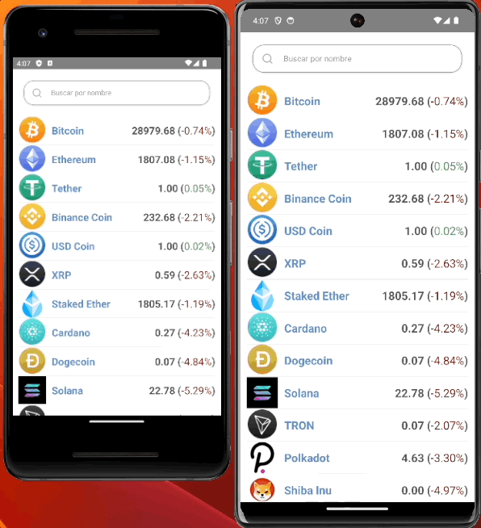
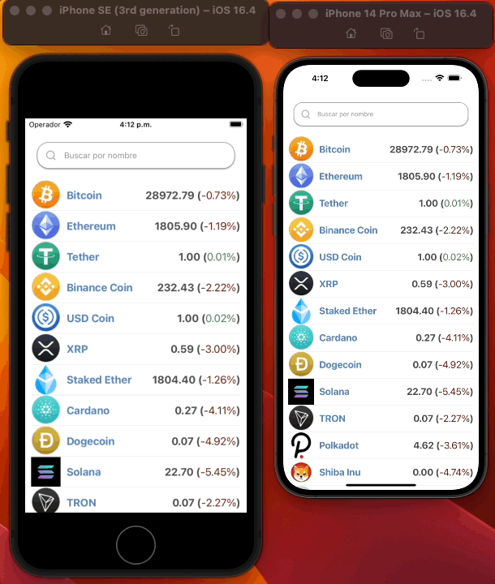

# CHALLENGE




# Getting Started

>**Note**: Make sure you have completed the [React Native - Environment Setup](https://reactnative.dev/docs/environment-setup) instructions till "Creating a new application" step, before proceeding.

# Requirements
>**Note**: This project was made with <kbd>Node Version 20.5.0</kbd> and <kbd>Ruby Version 2.7.5p203</kbd> , but it can run on <kbd>Node Version 16.20.1</kbd>.

After cloning this repo, don't forget to install <kbd>Node packages</kbd> and <kbd>pods</kbd>. 
You  can use 
```bash
yarn install
npx pod-install
# or
cd ios
yarn pod install 
```

And make the file <kbd>.env</kbd> in the root with the following environment variable.

```bash
BASE_URL_COIN_CAP=https://assets.coincap.io/
BASE_URL_COIN_LORE=https://api.coinlore.net/api/
```

## Step 1: Start the Metro Server

First, you will need to start **Metro**, the JavaScript _bundler_ that ships _with_ React Native.

To start Metro, run the following command from the _root_ of your React Native project:

```bash
yarn start
```

## Step 2: Start your Application

Let Metro Bundler run in its _own_ terminal. Open a _new_ terminal from the _root_ of your React Native project. Run the following command to start your _Android_ or _iOS_ app:

### For Android

```bash
yarn android
```

### For iOS

```bash
yarn ios
# or iphone  14por max use 
yarn ios:14max
```
